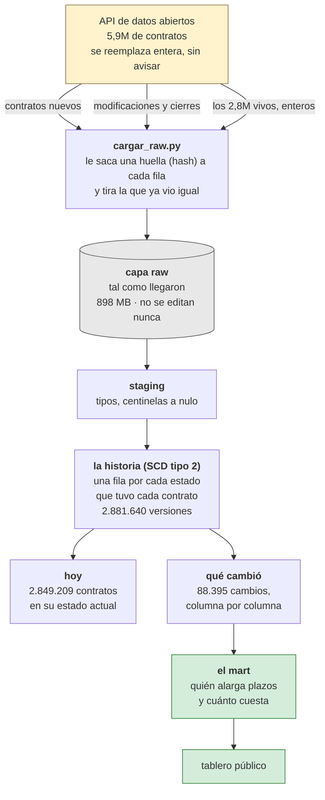

# SECOP: reconstruir lo que el Estado colombiano borra

[](https://github.com/cristian23cor/secop-analytics-platform/actions/workflows/ci.yml)

Colombia publica todos sus contratos públicos como datos abiertos: casi seis
millones de filas, gratis y sin registrarse.

El problema es que cada vez que actualizan el archivo, lo reemplazan entero.

No borran contratos: borran el pasado de cada uno. Si un contrato de mil millones
se amplía a mil quinientos, la fila cambia y la anterior desaparece. Nadie puede
consultar cuánto valía antes, ni cuánto se había pagado en marzo, ni cuántas veces
le corrieron la fecha de entrega. Esa historia no queda archivada en ningún lado.

**Este proyecto le saca una foto cada vez que el archivo se actualiza, y con esas
fotos reconstruye la historia.**

El tablero está en <https://cristian23cor.github.io/secop-analytics-platform/> y
se genera solo desde los datos, no se edita a mano.

---

## Cómo funciona



Tres formas de pedirle datos a la fuente, un cargador que guarda solo lo que
cambió, y las tres capas de transformación que usa dbt (staging, intermediate y
marts) para armar un **modelo dimensional**: una tabla de hechos en el centro y
cinco dimensiones alrededor.

---

## Por qué hace falta todo eso

Un vendedor que le quiere vender al Estado se hace siete preguntas. Cinco se
contestan con los datos tal como vienen: quién compra lo que yo vendo, quién es
el proveedor dominante, cuánto vale un contrato típico, cuándo salen las
licitaciones, cuánto se adjudica a dedo.

Las otras dos no:

> **6.** ¿Qué entidades alargan sistemáticamente los plazos, y cuántos días?
>
> **7.** ¿Cuánto cuesta ese alargue en pesos?

Para contestarlas hay que comparar el contrato de hoy contra el de antes, y "el
de antes" no existe en ninguna fuente pública. Lo busqué antes de ponerme a
construirlo:

- El archivo oficial de modificaciones tiene una fila por cada cambio y **ninguna
  columna con el monto**. La plata está escrita en prosa, en letras y en números,
  mezclada con el cambio de fecha en la misma frase.
- Su única columna de fecha está corrupta, y de una forma que ningún sistema
  detecta (más abajo).
- La publicación en un formato internacional que sí modelaba esto se apagó en
  2022.

O sea: el Estado publica que hubo un cambio, pero no cuánto. Este proyecto
reconstruye el cuánto comparando fotos.

---

## Por qué hay que bajarlo todo cada vez

La fuente no tiene ninguna columna que diga cuándo cambió cada fila. Hay tres
cosas que pueden cambiar y solo dos dejan rastro:

| Qué cambió | Cómo se detecta |
|---|---|
| Se firmó un contrato nuevo | filtrando por fecha de firma |
| Lo modificaron, lo cedieron o lo cerraron | filtrando por fecha de actualización |
| Le pagaron una cuota | **ninguna columna lo registra** |

El tercero afecta a 735.809 contratos, y es el que obliga a bajar los 2,8
millones de contratos vivos completos y compararlos uno por uno.

Ese barrido tarda unos cincuenta minutos y trae 8 GB. En disco quedan **18 MB**,
porque el cargador **deduplica por bytes**: le calcula una huella a cada fila
antes de escribirla y descarta la que ya vio idéntica. En la última corrida medida tiró el 98,13% de
las filas que ya conocía.

---

## Cómo correrlo

Hace falta Python 3.12 y [uv](https://docs.astral.sh/uv/). Nada más.

```bash
uv sync

# Bajar la foto de hoy. Tarda ~50 minutos.
uv run python scripts/cargar_raw.py --flujo vivos

# Armar el modelo. ~3 minutos.
cd dbt && uv run dbt build --profiles-dir .
```

El cargador pregunta primero si la fuente cambió desde la última vez, y **si no
cambió no baja nada**. Así que correrlo dos veces el mismo día no cuesta nada.
Sale con el código 4 en ese caso, distinto de los códigos de error, para que un
orquestador pueda diferenciar "no había nada nuevo" de "algo se rompió".

Los otros dos flujos son ventanas de un día y tardan segundos:

```bash
uv run python scripts/cargar_raw.py --flujo nuevos  --desde 2026-08-20 --hasta 2026-08-21
uv run python scripts/cargar_raw.py --flujo eventos --desde 2026-08-20 --hasta 2026-08-21
```

---

## Lo que apareció en el camino

Cualquiera procesa millones de filas. Lo que cuesta es encontrar los defectos que
la fuente no confiesa. Cada uno de estos está documentado en `exploration/` con la
consulta que lo reproduce.

### Un archivo oficial con las fechas cortadas al primer dígito

El registro de modificaciones tiene 26,5 millones de filas y una columna de fecha
que el sistema acepta sin quejarse. En ninguna de esas 26,5 millones el día pasa
de 9. El mes tampoco.

Las fechas están cortadas al primer dígito: el 21 de diciembre quedó guardado como
1 de enero, el 15 de julio como 1 de julio.

Lo confirmé de dos formas, y la segunda prueba el mecanismo y no solo el síntoma.
Si cortás el día, el "1" se traga once días reales (el 1 y del 10 al 19), el "2"
otros once, el "3" apenas tres, y del "4" al "9" uno cada uno. Contando filas, el
1 pesa 12,6 días, el 2 pesa 14,0 y el 3 pesa 3,0. La hipótesis predecía 11, 10,9 y
2,5. Ninguna otra explicación da esa distribución.

El daño no es parejo, y ahí está lo útil: **el año sobrevive siempre, el mes en el
79% de las filas y la fecha entera en el 13,6%.** Como los meses solo llegan a 12,
apenas tres se pierden; los días llegan a 31 y se pierden veintidós. Se sabe fila
por fila de cuál fiarse.

### Dos archivos publican las mismas filas con las etiquetas al revés

Comparando conteos por año entre el registro de modificaciones y el de
suspensiones aparecieron catorce números idénticos, pero cruzados. No era
casualidad: son las mismas filas, y uno de los dos las tiene mal etiquetadas. Se
sabe cuál leyendo la descripción: ocho de ocho filas dicen "se suspende" y están
clasificadas como reactivación.

Ninguna de las dos fichas oficiales dice que uno sea copia del otro.

### La fuente dice que se actualiza a diario y no es cierto

Esta fue la que más costó, porque la evidencia estaba a la vista y nadie la había
leído.

En diez días observados hubo **tres actualizaciones y siete días sin ninguna**.
Los saltos son de dos, cinco y siete días. No hay un solo par separado por
exactamente un día. El 1 de septiembre de 2026 seguía publicada la foto del 25 de
agosto.

Y no es que la plataforma esté caída: un archivo hermano, que se escribe
continuamente, registró escrituras esa misma mañana. Lo que está detenido es el
proceso que rehace la vista pública.

Se detecta con una consulta de dos segundos. Y tiene una consecuencia directa:
**el pipeline no puede dispararse por horario.** Ningún horario le acierta a algo
que a veces no pasa, así que se dispara mirando el estado de la fuente.

### Seis entidades cambiaron de clasificación y ya no queda rastro

Entre la foto del 23 de agosto y la del 25, 20.675 contratos cambiaron la
clasificación de su entidad. Son seis entidades, y el cambio va en las dos
direcciones: una unidad del SENA pasó a centralizada mientras otra del mismo SENA
pasó a descentralizada, el mismo día.

Quien consulte SECOP hoy no puede enterarse: la fuente se sobrescribió y solo
muestra el valor nuevo. **Ese evento existe únicamente porque guardamos las dos
fotos**, y es la premisa del proyecto demostrada con un caso real.

### Siete contratos valen más que el presupuesto del país

El Presupuesto General de la Nación de 2026 es de 546,9 billones de pesos. Siete
contratos declaran valores por encima. El mayor, 12.858 billones, lo supera
veintitrés veces y es de un instituto municipal de deportes.

Los siete son válidos para el sistema de tipos: son números bien escritos. En 2,9
millones de filas el tipado atrapa **un solo** valor mal formado y toda la demás
basura pasa. Esto solo lo detecta una regla de negocio con un techo defendible, y
el techo se elige contra una cifra pública, no a ojo.

La plata no se movió: seis de los siete declaran cero pagado. Son errores de
tipeo publicados sin ningún filtro, y lo que se sostiene es que la fuente oficial
no valida sus propios valores.

### El 21% de los contratos no dice en qué ciudad es

Al armar la dimensión geográfica parecía que otra columna podía rellenar los
611.751 contratos sin ciudad. No puede: recupera 2.875, el 0,47%. Los demás traen
"No Definido" adentro del texto, así que esa columna **miente cuando dice que no
tiene nulos**: el valor está, pero es un centinela, no un dato.

Y trae una trampa aparte: un departamento se llama *San Andrés, Providencia y
Santa Catalina*, con comas en el nombre. Separar por comas habría inventado un
departamento llamado "Providencia y Santa Catalina" con 13.102 contratos, sin que
nada fallara.

Un análisis por municipio deja afuera la quinta parte de la contratación, y eso
hay que decirlo en vez de disimularlo.

De paso, contando esa misma dimensión: sumando contratación directa, directa con
ofertas y régimen especial, **lo que se adjudica sin licitación abierta supera el
90%** de los contratos.

### El 38,8% de lo que la fuente marca como cambio no cambió nada

Entre dos fotos, la fuente publicó 52.954 contratos como modificados. De esos,
solo 32.431 cambiaron algo del contrato. Los otros 20.523 cambiaron el registro y
no el contrato, y casi todos por un mismo trámite administrativo.

Por eso el modelo clasifica las 85 columnas en tres grupos antes de decidir si
guarda una versión nueva. Sin esa clasificación la historia tendría un 60% más de
filas y ni un dato más.

---

## Las decisiones que le dan forma

El razonamiento completo, con las alternativas descartadas, está en
`exploration/03_decisiones_capa_raw.md`.

**Entre un error que sobra y uno que falta, se elige el que sobra.** Resolvió seis
de las ocho decisiones de arquitectura. La comparación mira los bytes crudos, así
que puede guardar una fila de más si la fuente cambia `"1000"` por `"1000.00"`,
pero nunca puede tirar un cambio real. El cargador escribe el archivo antes de
anotar la huella, así que si se corta la luz queda un duplicado en disco y no una
fila perdida. Cuando se puede elegir hacia qué lado fallar, se elige el que se
puede corregir después.

**Los archivos crudos se guardan sin tocar un carácter.** La tentación de
limpiarlos al escribir es fuerte y sale cara: si la limpieza tiene un error, con
los datos crudos se arregla el código y se vuelve a procesar; con los datos ya
limpiados queda un agujero permanente, porque la fuente original se sobrescribió.

**La lista de columnas no se documenta, se genera.** La clasificación de las 85
columnas vive en un archivo de Python. Un script escribe desde ahí lo que usa dbt,
y otro falla si los dos se separan en un solo byte. No hay dos listas que alguien
tenga que mantener iguales: hay una, y la otra sale de ella.

**Un solo archivo sabe contra qué base de datos está corriendo.** Los datos crudos
se leen en un único **modelo frontera** que se ramifica: DuckDB los lee del disco,
Snowflake de su propio almacén. El resto del proyecto no se entera.

Eso salió a medias la primera vez, y la corrección vale más que el acierto. "Un
solo archivo toca los datos crudos" no es lo mismo que "un solo archivo habla el
dialecto": la capa de limpieza usaba funciones que solo existen en DuckDB, y nadie
lo había notado en tres días. Lo destapó una búsqueda de treinta segundos.

**La historia (un SCD tipo 2) está escrita a mano y no con `dbt snapshot`.** Esa función
compara contra la tabla de destino en vez de contra los archivos, lo que impediría
corregir el pasado, y no sabe expresar que 32 columnas pueden cambiar sin que eso
cuente como un cambio real.

**Las fechas se llaman "observado desde" y "observado hasta", no "vigente".** La
plataforma no sabe cuándo cambió el contrato: sabe cuándo el cambio se hizo
visible. Un pago detectado el 25 pudo ocurrir cualquier día desde la observación
anterior, y con la fuente saltando días ese hueco puede ser de una semana. Un
nombre que promete menos vale más.

---

## Lo que no hace, y por qué

**No se puede recuperar la historia vieja.** No existe en ninguna fuente pública.
La tabla de versiones arranca vacía y va madurando con el tiempo.

**La historia tiene la resolución de la fuente, no la diaria.** Si entre dos fotos
pasaron siete días, dos modificaciones del mismo contrato llegan juntas y son
indistinguibles. El diseño lo aguanta; lo que no se puede es inventar los días que
faltan.

**Los cálculos de alargue solo valen para contratos que vimos desde su firma.**
Esta es la limitación más importante y la más fácil de esconder. Un contrato
firmado en 2021 al que le vimos una sola versión no es un contrato sin
modificaciones: es uno cuya historia empieza el día que encendimos el pipeline,
con todos sus cambios anteriores ya incorporados en la primera foto.

Hoy eso deja poquísimo: **la pregunta 7 se apoya en 39 contratos** de 29
entidades. Con esa base la palabra "sistemáticamente" no se sostiene. Sin esa
restricción hay 1.925, pero ese número es un piso y no una medición: es una **cota
inferior**, y el fenómeno se llama **censura por la izquierda**.

El modelo no elige por vos: lleva las dos poblaciones separadas, cada una con su
tamaño al lado, y la medible crece sola con cada foto nueva.

**El análisis arranca en 2020.** Antes de ese año la curva no mide gasto público
sino cuánta gente usaba la plataforma: se pasó de diez contratos en 2015 a más de
un millón en 2025.

**Tres columnas de clasificación no son confiables.** Un hospital departamental
figura como "Nacional" y una empresa social del Estado como "Corporación
Autónoma". El diccionario oficial las define de forma circular. Entran con la
advertencia escrita y no se construye nada encima.

**Los datos personales quedan afuera desde la descarga.** El archivo expone
cédulas, nombres completos, género y domicilio del representante legal, del
ordenador del gasto y del supervisor. Son legalmente abiertos, pero republicarlos
en un tablero es una decisión distinta a consultarlos. Son 18 columnas y el filtro
va en la petición a la API, no después: **la exclusión más fácil de auditar es la
que hace que el dato no viaje.**

---

## En qué está

Funciona de punta a punta.

| | |
|---|---|
| Ingesta | los tres flujos, con reintentos y deduplicación por huella |
| Modelo | 11 tablas, 5 dimensiones, la historia completa y el resultado final |
| Pruebas | 294 de Python y 46 de dbt, corriendo solas en cada push |
| Tablero | publicado, se regenera desde los datos |
| Orquestador | escrito y probado; falta levantarlo en algún lado |
| Vigilancia | una consulta cada tres horas avisa cuando la fuente se mueve |

La construcción completa tarda **3 minutos** en un portátil y **70 segundos** en
Snowflake. Dos de las once tablas usan **materialización incremental**: solo procesan lo que
llegó nuevo, y eso bajó la construcción de 344 segundos a 184.

### El porte a Snowflake está verificado, no solo conectado

Los mismos once archivos corren en las dos bases de datos, sin un solo modelo
duplicado. `exploration/paridad_de_motores.md` los compara con 38 comprobaciones
que no son solo conteos de filas: las huellas de la ingesta, las conversiones de
tipo, las ventanas que arman la historia, la jerarquía de categorías y los cuatro
contadores del resultado final. **Las 38 coinciden.**

En `exploration/evidencia/` están las capturas de esa corrida.

La cuenta de Snowflake es de prueba y vence el 12 de septiembre de 2026. Después
de esa fecha no se puede ejecutar allá, y el repositorio no depende de eso: las
pruebas automáticas nunca la tocan, todo apunta a DuckDB por defecto, y lo que
queda como evidencia es el informe fechado.

### Lo que falta

Levantar el orquestador en algún lado. Que las otras nueve tablas sean
incrementales. Y una comprobación que avise si la fuente agrega una columna
nueva, que hoy es el único lugar donde el proyecto podría perder datos sin
enterarse.

Las preguntas abiertas están numeradas en `exploration/`. Algunas necesitan datos
que todavía no conseguí: el catálogo de categorías para traducir códigos a
nombres, y el calendario de festivos colombianos.

---

## Cómo se verifica

Dos costumbres que este proyecto adoptó por haberse equivocado.

**Un número sin decir sobre qué se midió no es un número.** Cinco cifras
documentadas como medidas resultaron falsas, todas por lo mismo: tomadas sobre
muestras chicas y después citadas como hechos. Ahora cada cifra lleva escrito
sobre qué se midió.

**Un test que solo se vio dar cero no demuestra que sepa dar otra cosa.** Por eso
hay guiones que **rompen el código a propósito** y comprueban que las pruebas se
quejen. `verificar_tests_del_snapshot.py` siembra veintidós defectos en tablas
falsas y comprueba que los veintidós salgan con el motivo correcto. El mismo
método se aplicó a los reintentos de red, al orquestador y a la comparación entre
bases de datos: doce roturas provocadas, doce detectadas.

**Y todo eso corre solo en cada push**, en menos de un minuto. Ninguna
comprobación toca internet, y no es casualidad: una prueba que falla porque el
portal del Estado está caído enseña a ignorar las pruebas.

| | |
|---|---|
| Las 294 pruebas de Python | con imitaciones de la API |
| La lista de columnas contra lo que usa dbt | byte a byte |
| Que las pruebas del modelo detecten sus defectos | 22 sembrados, 22 detectados |
| Las 11 tablas y sus 46 pruebas | sobre datos falsos generados al vuelo |
| Que lo incremental dé lo mismo que rehacer todo | seis etapas comparadas fila por fila |
| Que el orquestador conserve sus decisiones | sin levantar nada |

---

## El repositorio

```
scripts/
  se corren a mano
    cargar_raw.py                    Baja datos. El punto de entrada
    sondear.py                       Pregunta si la fuente cambio. 2 segundos

  se generan, no se editan
    generar_columnas_dbt.py          De columnas.py sale lo que usa dbt
    generar_raw_sintetico.py         Datos falsos, para que las pruebas corran sin internet
    generar_tablero.py               Escribe el tablero desde el modelo

  corren solas en cada push
    verificar_columnas_dbt.py        Falla si las dos listas de columnas se separan
    verificar_tests_del_snapshot.py  Siembra 22 defectos, comprueba que salgan
    verificar_incremental.py         Lo incremental da lo mismo que rehacer todo

  a mano, y tocan internet
    verificar_extraccion.py          Contra la API real
    verificar_carga_raw.py           Contra la API real, cuatro fases
    verificar_paridad_de_motores.py  DuckDB contra Snowflake
    subir_raw_a_snowflake.py         Sube los datos crudos al almacen de Snowflake

  analisis puntuales
    medir_rn1.py                     Las seis fuentes de financiacion contra los datos crudos

src/secop_analytics/
  columnas.py       Que se descarga y como se compara. De aca sale todo lo demas
  paginacion.py     Lo unico que conoce la API. Paginacion por keyset, con reintentos
  flujos.py         Los tres flujos de ingesta
  hashing.py        La huella de cada fila
  indice.py         Las huellas ya vistas. Se puede reconstruir desde los archivos
  escritura.py      JSONL comprimido, particionado estilo Hive, y marca de completitud

dbt/
  models/staging/        Donde se leen los archivos y se limpia
  models/intermediate/   Que columna cambio en cada version, y cuanto
  models/marts/          El resultado: la historia, el hoy y la respuesta
  macros/                Lo generado desde columnas.py, y el despacho por adaptador
  tests/                 Reglas de negocio e invariantes

exploration/                        El razonamiento completo
  00_inventario_fuentes.md            La fuente principal y sus hallazgos
  01_modelo_dimensional.md            El modelo y las reglas de negocio
  02_ecosistema_secop.md              Los archivos hermanos y por que no entran
  03_decisiones_capa_raw.md           Cada decision con su alternativa descartada
  cadencia.csv                        Un dia por linea. El unico dato irrecuperable
  paridad_de_motores.md               38 comprobaciones, DuckDB contra Snowflake
  evidencia/                          Capturas de la corrida en Snowflake

dags/secop_ingesta.py    El orquestador. Se dispara por la fuente, no por reloj
docs/index.html          El tablero que publica GitHub Pages
tests/                   294 pruebas
.github/workflows/       Las comprobaciones y el sondeo, corriendo solos
```
## Licencia y fuente

Los datos son públicos, publicados por la Agencia Nacional de Contratación
Pública: Colombia Compra Eficiente bajo la Ley 1712 de 2014, y se consultan
desde
`datos.gov.co`. El código es mío y el análisis también, incluidos los errores.
